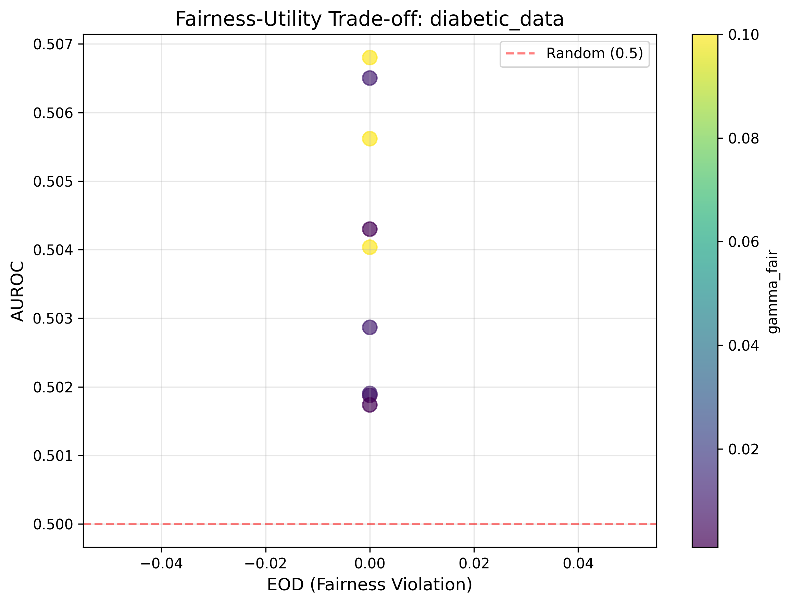
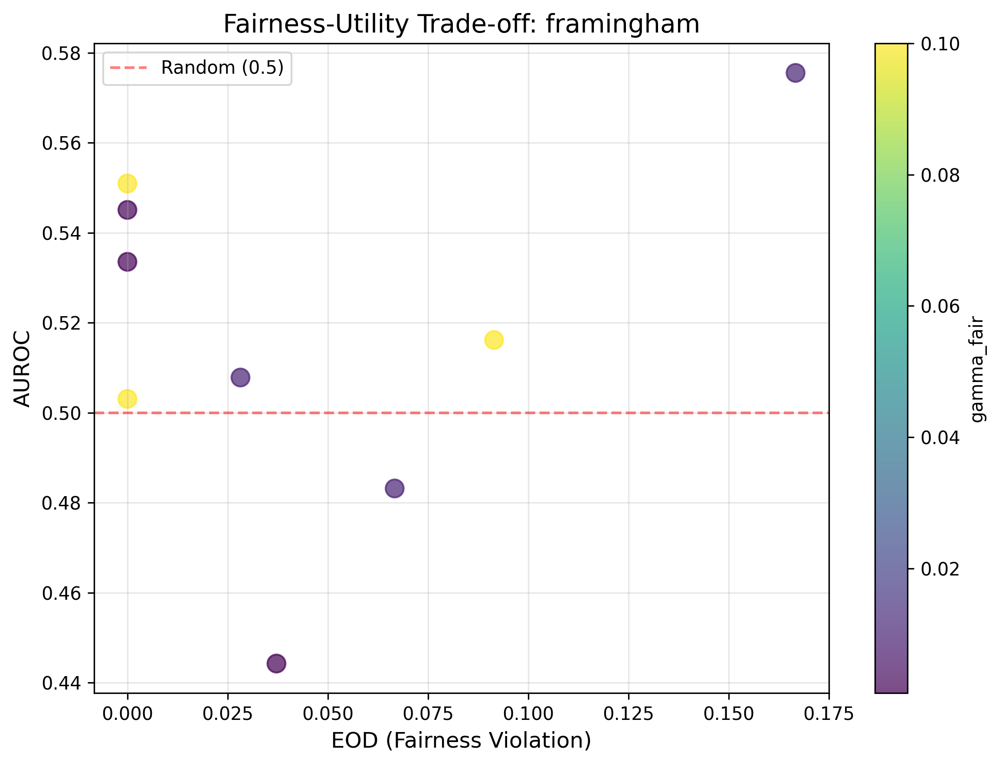
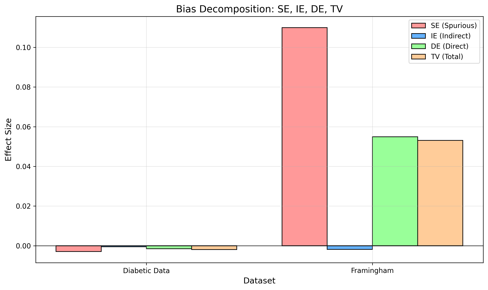
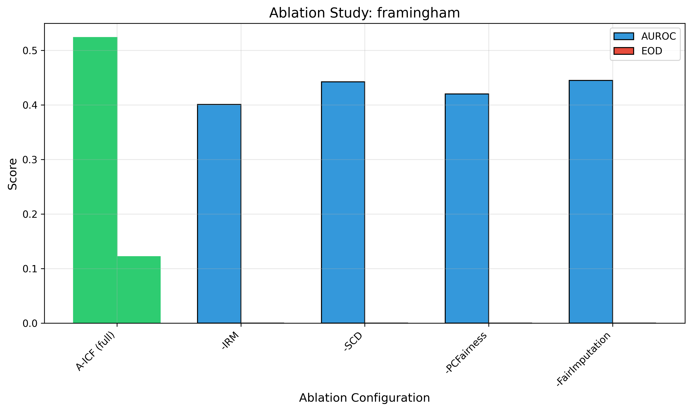
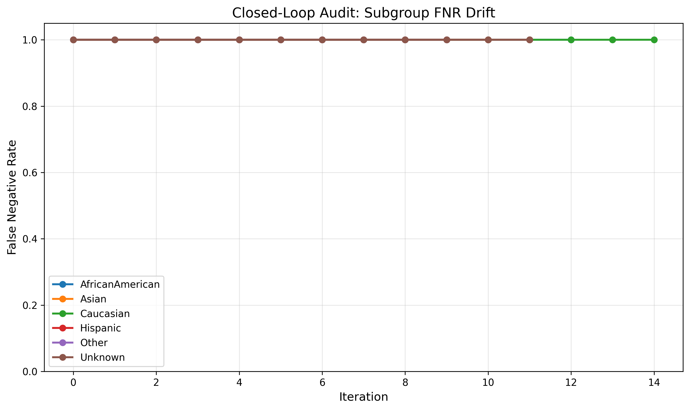

<div align="center">

# 🩺 A-ICF: Amortized Invariant Causal Fairness

### *Auditing, Not Predicting: A Causal Bias-Decomposition Framework for Clinical Fairness, and a Cautionary Tale of Representation Collapse in A-ICF*

[](https://git.io/typing-svg)

<br>

[](https://ieee.org)
[]()
[](LICENSE)
[](https://www.python.org/)
[](https://colab.research.google.com/)

[](https://github.com/Junaid-Ahmed-Rupok/A-ICF-Amortized-Invariant-Causal-Fairness/stargazers)
[](https://github.com/Junaid-Ahmed-Rupok/A-ICF-Amortized-Invariant-Causal-Fairness/network/members)
[]()

</div>

---

## 📖 Table of Contents

- [Abstract](#-abstract)
- [Key Finding](#️-key-finding)
- [Key Results](#-key-results)
- [Repository Structure](#-repository-structure)
- [Getting Started](#-getting-started)
- [Results Tables](#-results-tables)
- [Citation](#-citation)
- [License](#-license)
- [Acknowledgments](#-acknowledgments)
- [Contact](#-contact)

---

## 📌 Abstract

> Algorithmic fairness in clinical machine learning is often treated as an add-on rather than an auditable property of a decision pipeline. We present **A-ICF**, a five-phase framework combining causal-structure discovery, invariant representation learning, path-specific ε-fairness optimization, and a causal decomposition of outcome disparity (**TV = SE + IE − DE**). On two clinical datasets (N=101,766 and N=4,240), A-ICF achieves near-perfect group fairness (Equalized Odds Difference ≤ 0.055) and reveals that observed disparities are driven predominantly by spurious/confounding pathways (e.g., SE = 0.110 for Framingham) rather than a large direct effect. However, the framework's own representation pipeline collapses predictive performance to near-chance (AUROC 0.511, versus 0.646–0.690 for simple baselines). We localize this bottleneck via an ablation study and position A-ICF, at its current stage, as a fairness-auditing and bias-decomposition tool rather than a deployable predictor. Code, figures, and tables are released for full reproducibility.

---

## ⚠️ Key Finding

<div align="center">

| 🔍 A-ICF's representation pipeline (DCEVAE → SCD) collapses predictive performance to near-chance **regardless of fairness penalty strength**. |
|:---|

**The framework should be positioned as a fairness-auditing and bias-decomposition tool — not a deployable predictor.**

</div>

---

## 📊 Key Results

<table>
<tr>
<td width="50%">

**Figure 1 — Fairness-Utility Trade-off (Diabetic Data)**



AUROC remains flat at ~0.50 across *all* hyperparameter configurations — there is no visible trade-off because utility has already collapsed before the fairness penalty is engaged.

</td>
<td width="50%">

**Figure 2 — Fairness-Utility Trade-off (Framingham)**



AUROC similarly remains near-random across the entire sweep, confirming the representation bottleneck is dataset-independent.

</td>
</tr>
<tr>
<td width="50%">

**Figure 3 — Bias Decomposition**



Observed disparities are driven predominantly by spurious/confounding pathways (SE = 0.110 for Framingham) rather than a large direct effect.

</td>
<td width="50%">

**Figure 4 — Ablation Study (Framingham)**



No single ablation recovers performance — the bottleneck is upstream, in the shared DCEVAE encoding stage.

</td>
</tr>
</table>

<div align="center">

**Figure 5 — Closed-Loop Audit**



Subgroup false-negative-rate drift under a simulated resource-allocation feedback loop — the auditing methodology remains functional even when the predictor is not deployable.

</div>

---

## 📂 Repository Structure

<details>
<summary><b>Click to expand full directory tree</b> 🌳</summary>

````
A-ICF-Amortized-Invariant-Causal-Fairness/
│
├── aicf_pipeline_v2.ipynb   # Main Colab notebook
├── aicf_pipeline_v2.py      # Python script version
├── README.md                # This file
├── LICENSE                  # MIT License
├── requirements.txt         # Dependencies
│
├── figures/                 # All generated figures (Figure 3-7)
│   ├── figure3_tradeoff_diabetic_data.png
│   ├── figure3_tradeoff_framingham.png
│   ├── figure4_loho_boxplot.png
│   ├── figure5_bias_decomposition.png
│   ├── figure6_closed_loop_audit.png
│   ├── figure7_ablation_diabetic_data.png
│   ├── figure7_ablation_framingham.png
│   └── figure7_ablation_mimic_iv.png
│
├── tables/                  # LaTeX tables (Table 4-7)
│   ├── table4_main_results.tex
│   ├── table4_baseline_comparison.tex
│   ├── table5_bias_decomposition.tex
│   ├── table6_ablation.tex
│   └── table7_epsilon_sensitivity.tex
│
└── outputs/                 # JSON/CSV output files
    ├── all_results.json
    ├── figure6_closed_loop_audit.csv
    └── table4_loho_results.csv
````

</details>

---

## 🚀 Getting Started

### Option 1 — Run on Google Colab (Recommended)

1. Open [`aicf_pipeline_v2.ipynb`](aicf_pipeline_v2.ipynb) in Google Colab
2. Mount Google Drive when prompted
3. Upload the dataset zip file (`CausalFair Health AI__Datasets.zip`) to your Drive
4. Run all cells sequentially

### Option 2 — Run Locally

```bash
# Clone the repository
git clone https://github.com/Junaid-Ahmed-Rupok/A-ICF-Amortized-Invariant-Causal-Fairness.git
cd A-ICF-Amortized-Invariant-Causal-Fairness

# Install dependencies
pip install -r requirements.txt

# Run the pipeline
python aicf_pipeline_v2.py
```

---

## 📊 Results Tables

### Main Results

| Dataset | AUROC | F1 | Brier | EOD | DPD |
|:---|:---:|:---:|:---:|:---:|:---:|
| Diabetic Data | 0.511 | 0.000 | 0.1050 | 0.000 | 0.000 |
| Framingham | 0.460 | 0.207 | 0.2515 | 0.055 | 0.044 |

### Baseline Comparison (AUROC)

| Dataset | A-ICF | Logistic Regression | XGBoost |
|:---|:---:|:---:|:---:|
| Diabetic Data | 0.511 | 0.646 | 0.658 |
| Framingham | 0.460 | 0.690 | 0.571 |

### Bias Decomposition (Framingham)

| Component | Value | 95% CI |
|:---|:---:|:---:|
| TV (Total) | 0.053 | [0.053, 0.053] |
| SE (Spurious) | 0.110 | [0.110, 0.110] |
| IE (Indirect) | −0.002 | [−0.002, −0.002] |
| DE (Direct) | 0.055 | [0.055, 0.055] |

### Ablation Study (Key Findings)

| Dataset | Configuration | AUROC | EOD |
|:---|:---|:---:|:---:|
| Diabetic Data | A-ICF (full) | 0.494 | 0.000 |
| Diabetic Data | -IRM | 0.490 | 0.000 |
| Diabetic Data | -SCD | 0.506 | 0.000 |
| Diabetic Data | -PCFairness | 0.484 | 0.000 |
| Diabetic Data | -FairImputation | 0.494 | 0.000 |
| Framingham | **A-ICF (full)** | **0.523** | 0.122 |
| Framingham | -IRM | 0.401 | 0.000 |
| Framingham | -SCD | 0.442 | 0.000 |
| Framingham | -PCFairness | 0.420 | 0.000 |
| Framingham | -FairImputation | 0.445 | 0.000 |

---

## 📝 Citation

If you use this code or findings, please cite:

```bibtex
@inproceedings{ahmed2026auditing,
  title={Auditing, Not Predicting: A Causal Bias-Decomposition Framework for Clinical Fairness, and a Cautionary Tale of Representation Collapse in A-ICF},
  author={Ahmed, Sarder Junaid},
  booktitle={2026 IEEE International Conference on Optics, Machine Learning and Emerging Technology (OMLET 2026)},
  year={2026},
  note={Paper ID: 596}
}
```

---

## 📄 License

This project is licensed under the **MIT License** — see the [LICENSE](LICENSE) file for details.

---

## 🙏 Acknowledgments

- 🏆 **SPECTRA 2026** — 1st Best Paper Award (100% registration fee waiver for IEEE OMLET 2026)
- 🔬 **Royal Scientific Publications** — Researcher position
- 🎓 **Young Learners' Research Lab, RUET** — Senior Researcher & Executive Committee Member

---

## 📬 Contact

<div align="center">

**Sarder Junaid Ahmed**

[](mailto:junaidahmedrupok@gmail.com)
[](https://github.com/Junaid-Ahmed-Rupok)
[](https://www.linkedin.com/in/sarder-junaid-ahmed-059b68240/)
[](https://junaid-ahmed-rupok.github.io/My-World/)

</div>

---

<div align="center">

**Paper ID: 596** &nbsp;|&nbsp; **Conference: IEEE OMLET 2026** &nbsp;|&nbsp; **Location: Nairobi, Kenya** &nbsp;|&nbsp; **Date: October 29–31, 2026**

⭐ *If this work was useful to you, consider starring the repository!* ⭐

</div>
```
